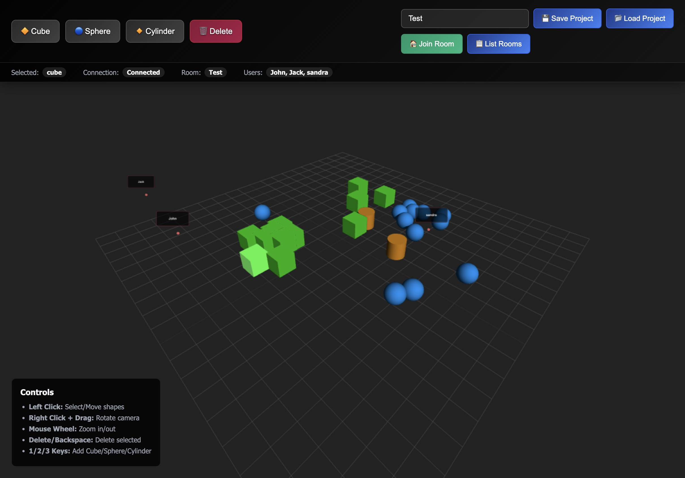

# Three.js Collaborative Editor

A real-time collaborative 3D shape editor built with Three.js, Node.js, Express, and Socket.io.



## Features

- **3D Scene Manipulation**: Create, move, and delete cubes, spheres, and cylinders
- **Real-time Collaboration**: Multiple users can work together in shared rooms
- **Project Management**: Save and load projects as JSON files
- **User Presence**: See other users' cursors and actions in real-time
- **Modern UI**: Glass-morphism design with smooth animations

## Getting Started

### Prerequisites

- Node.js (v14 or higher)
- npm

### Installation

1. Clone the repository:
```bash
git clone <repository-url>
cd threejs-socket
```

2. Install dependencies:
```bash
npm install
```

3. Start the server:
```bash
npm start
```

4. Open your browser and navigate to `http://localhost:3000`

### Development

For development with auto-reload:
```bash
npm run dev
```

## Usage

### Controls

- **Left Click**: Select and move shapes
- **Right Click + Drag**: Rotate camera
- **Mouse Wheel**: Zoom in/out
- **Delete/Backspace**: Delete selected shape
- **1/2/3 Keys**: Add Cube/Sphere/Cylinder

### Collaboration

1. Enter a room name in the input field
2. Click "Join Room" and optionally enter your name
3. Share the room name with others to collaborate
4. Use "List Rooms" to see active collaboration sessions

### Project Management

- **Save Project**: Save current scene to server
- **Load Project**: Load previously saved project
- Projects are stored as JSON files on the server

## Tech Stack

- **Frontend**: Three.js, HTML5, CSS3, JavaScript
- **Backend**: Node.js, Express
- **Real-time Communication**: Socket.io
- **Data Storage**: File-based JSON storage

## License

MIT License